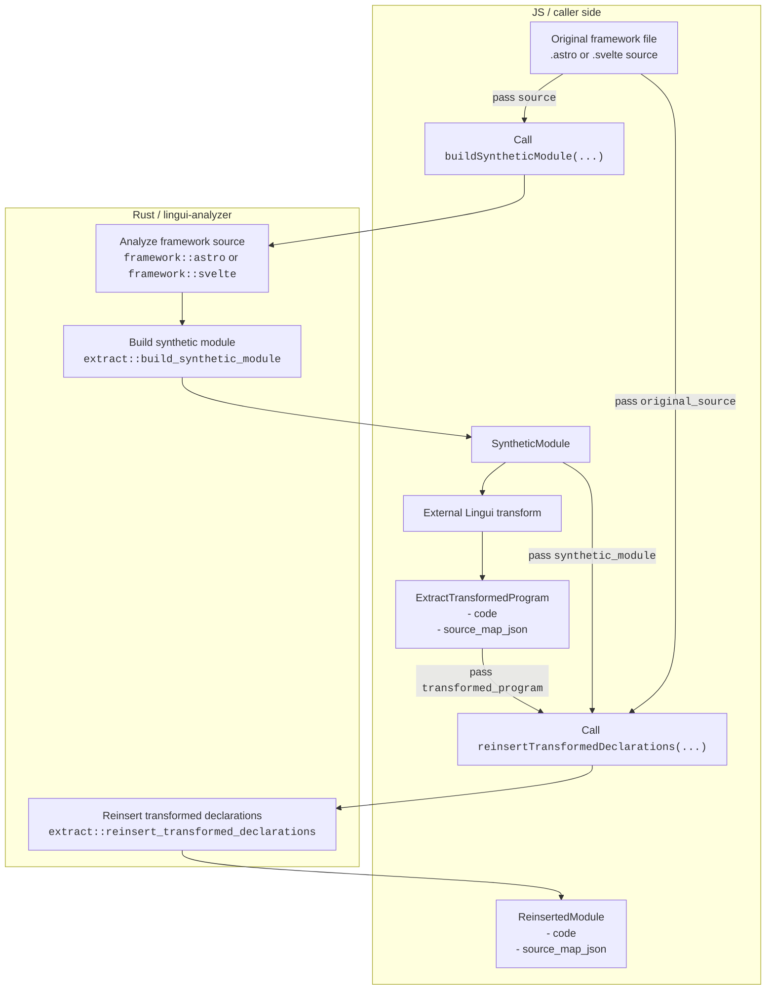
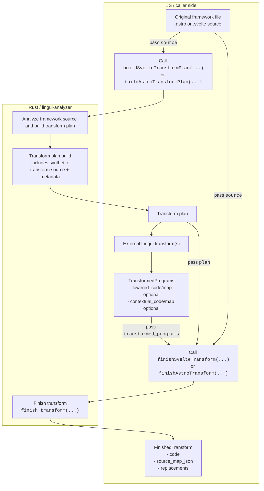

# `lingui-analyzer`

This document is for repository developers working on `crates/lingui-analyzer`, not for end users.

## Directory Structure

`src/` is organized by responsibility rather than by call site.

- `src/lib.rs`
  - Crate entrypoint.
  - Exposes the public Rust and WASM-facing APIs for extract and transform flows.
- `src/common/`
  - Cross-cutting value types and utilities that are not framework-specific.
  - Examples: spans, script language enums, indexed text, source map helpers, normalization edit utilities, declaration extraction helpers, text search.
- `src/syntax/`
  - Tree-sitter parsing entrypoints and parse errors.
  - If code only needs “parse this source into a syntax tree”, it should start here.
- `src/diagnostics/`
  - Diagnostic value types and framework-specific diagnostic constructors.
  - Shared formatting/display lives here, but callers should create diagnostics through framework-specific modules such as `diagnostics/astro.rs` or `diagnostics/svelte.rs`.
- `src/framework/`
  - Framework analysis layer.
  - Responsible for reading `.astro` / `.svelte` source and producing framework analysis results: imports, macro candidates, template/script regions, source metadata, and validation errors.
  - Framework-specific code belongs under `framework/astro/` or `framework/svelte/`.
  - `framework/shared/` is only for analysis helpers shared by multiple frameworks; code outside `framework/` should not depend on it directly.
- `src/synthesis/`
  - Converts analyzed macro candidates into normalized synthetic-source fragments and normalized segment metadata.
  - This is the bridge between raw framework analysis and generated synthetic modules / transform synthetic source.
- `src/extract/`
  - Extract pipeline.
  - Builds synthetic modules for external Lingui transforms, then reinserts transformed declarations back into the original framework source.
- `src/transform/`
  - Transform pipeline.
  - Builds transform plans, tracks transform targets, lowers transformed declarations back into framework runtime code, and emits final transformed source plus source maps.
  - `transform/adapters/astro/` and `transform/adapters/svelte/` hold framework-specific transform behavior.
- `src/conventions.rs`
  - Framework/macro/runtime naming conventions shared by extract and transform.

## Where Framework-Specific Code Goes

- Astro-specific analysis goes in `src/framework/astro/`.
- Svelte-specific analysis goes in `src/framework/svelte/`.
- Astro-specific transform-time behavior goes in `src/transform/adapters/astro/`.
- Svelte-specific transform-time behavior goes in `src/transform/adapters/svelte/`.
- Shared parsing belongs in `src/syntax/`.
- Shared non-framework data structures/utilities belong in `src/common/`.
- Place shared diagnostics in `src/diagnostics/`; callers should go through framework-specific modules.

## Extract Data Flow

Extract is split into two boundaries:

1. Build a synthetic module from one input framework file.
2. Reinsert one externally transformed synthetic program back into the original framework file.

Important fan-out points:

- One `.astro` or `.svelte` file can produce many macro candidates.
- Those candidates are emitted as many synthetic declarations inside one `SyntheticModule`.
- After the external Lingui transform runs, one transformed synthetic program is reinserted back into one original file.

### Extract Boundary Notes

- The analysis stage may collect candidates from multiple regions of one file:
  - Astro frontmatter and template expressions/components.
  - Svelte module script, instance script, and template expressions/components.
- `SyntheticModule` is the only artifact that leaves the analysis/build side of the extract flow.
- Reinsertion consumes:
  - the original source file,
  - the `SyntheticModule`,
  - one transformed synthetic program.

## Transform Data Flow

Transform is split into two explicit boundaries:

1. Build a framework-specific transform plan and synthetic transform source from one input file.
2. Finish transformation by combining the original file, the transform plan, and externally transformed programs.

Important fan-out points:

- One `.astro` or `.svelte` file can produce many transform targets.
- Those targets are grouped into one synthetic transform source.
- The plan-building boundary returns a framework-specific transform plan object that already contains the synthetic transform source and its metadata.
- External code transformation may return up to two transformed synthetic programs:
  - `lowered`
  - `contextual`
- Final emission folds many declaration-level replacements back into one output file.

### Transform Boundary Notes

- The transform plan is the only artifact that leaves the plan-building half of the transform flow.
- The transform plan already contains the synthetic transform source (`synthetic_source`) and related metadata, so `finish*Transform(...)` does not accept a separate synthetic module/source argument.
- `TransformTarget`s are declaration-scoped. One input file may produce many targets, each with:
  - original span,
  - normalized span,
  - output kind,
  - translation mode,
  - normalized segments.
- `TransformedPrograms` may contain one or both transformed synthetic programs, depending on which translation modes were needed for the file.
- `finishSvelteTransform(...)` / `finishAstroTransform(...)` consume exactly three inputs:
  - the original source file,
  - the framework-specific transform plan,
  - one `TransformedPrograms` value.
- Final emission applies many declaration-level replacements and runtime injections to produce one output module.

## Practical Reading Order

When tracing a bug or implementing a feature, the most useful top-down order is usually:

1. `src/lib.rs`
2. `src/framework/*`
3. `src/synthesis/mod.rs`
4. `src/extract/*` or `src/transform/*`
5. `src/common/*`, `src/syntax/*`, `src/diagnostics/*` as supporting layers
