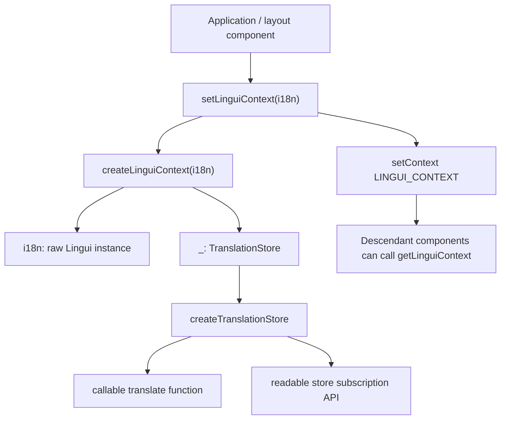
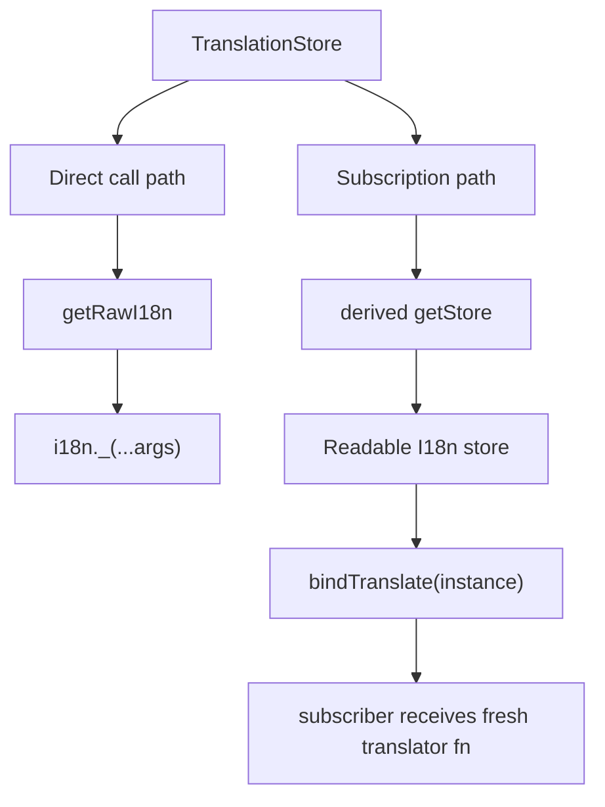
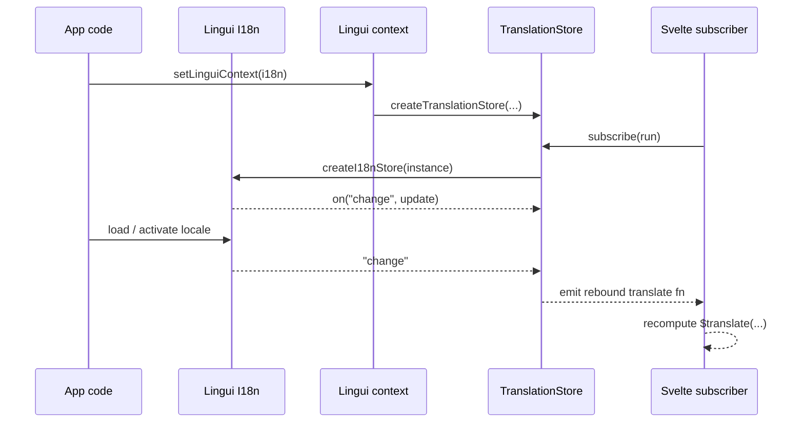
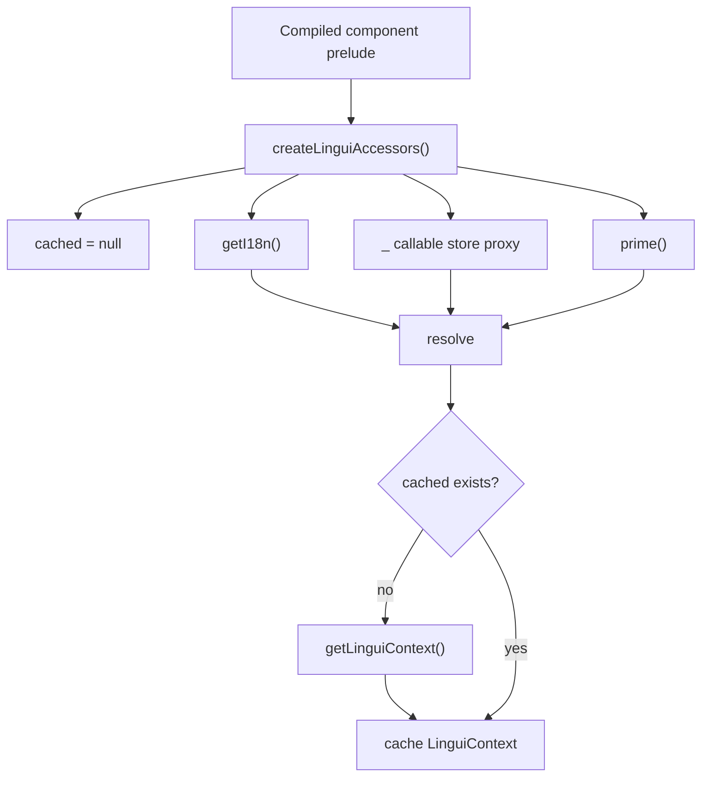
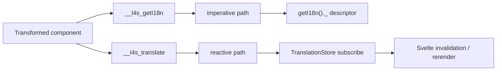
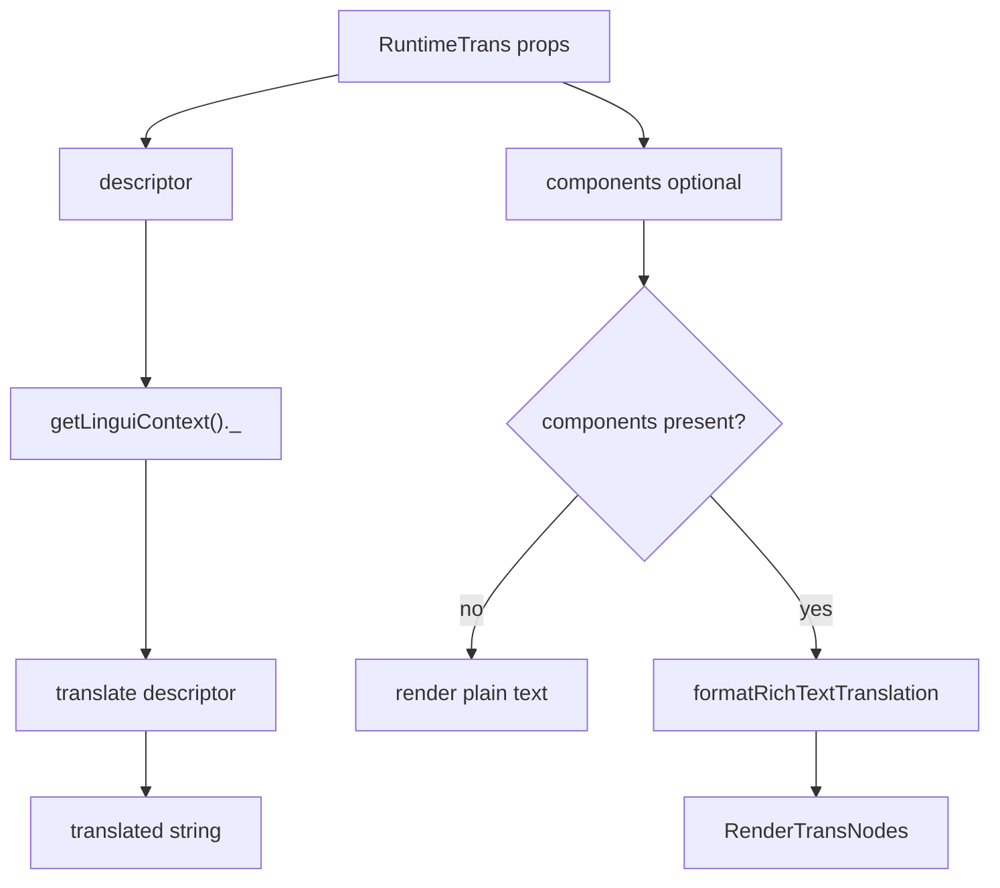

# lingui-for-svelte Reactivity Flow

This document explains how `lingui-for-svelte` wires Lingui into Svelte's
reactive model.

The runtime has three main pieces:

- `setLinguiContext` / `getLinguiContext` in `src/runtime/core/context.ts`
- `createTranslationStore` in `src/runtime/core/translation-store.ts`
- compiler-injected accessors created by `createLinguiAccessors`

At a high level:

- application code installs an `I18n` instance into Svelte context
- the runtime wraps that instance in a callable Svelte store
- compiled code reads translations either imperatively or reactively
- Lingui `"change"` events propagate back through the store and trigger updates

## 1. Context Setup

`setLinguiContext(instance)` is the entry point that turns a raw Lingui
instance into a runtime context for a Svelte subtree.

## 2. What the Translation Store Actually Is

`TranslationStore` is intentionally both:

- a callable translator: `translate(descriptor)`
- a Svelte readable store: `translate.subscribe(...)`

Direct calls and subscriptions take different paths.

## 3. How Lingui Change Events Reach Svelte

The reactive path exists because `createI18nStore(instance)` subscribes to
Lingui's `"change"` event and re-emits the same instance through a Svelte
`readable` store.

## 4. Why `createLinguiAccessors` Exists

Compiled components cannot always read Svelte context immediately.

Generated code may need to install helper bindings before user setup code has
run, but the actual Lingui context may only be available after that setup
finishes. `createLinguiAccessors` solves this by lazily resolving and caching
the context.

`prime()` is injected at the end of the transformed instance script so the
context is resolved after user initialization logic has had a chance to install
it.

## 5. Compiled Code: Imperative vs Reactive Reads

The Svelte transform injects two different runtime bindings:

- `getI18n`: used for imperative reads such as bare `t(...)`
- `_`: used for reactive reads such as `$t(...)`, `$plural(...)`, and friends

That means the compiler deliberately separates:

- non-reactive translation work, which reads `i18n._(...)` directly
- reactive translation work, which subscribes through the translation store

## 6. RuntimeTrans in This Model

`RuntimeTrans` is now a thin consumer of the same runtime context:

- it accepts a `descriptor`
- it translates through the reactive translator from context
- if rich-text `components` are present, it post-processes the translated
  string into render nodes

## 7. Mental Model

If you want the shortest possible mental model, it is this:

- Lingui owns translation state
- Svelte context makes that state reachable
- `TranslationStore` turns Lingui change events into Svelte reactivity
- compiler output chooses whether a translation should be imperative or
  reactive
- `RuntimeTrans` is just another consumer of the same reactive translator
